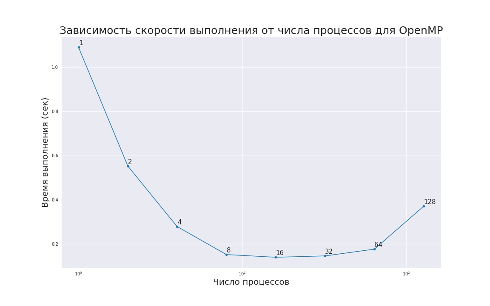
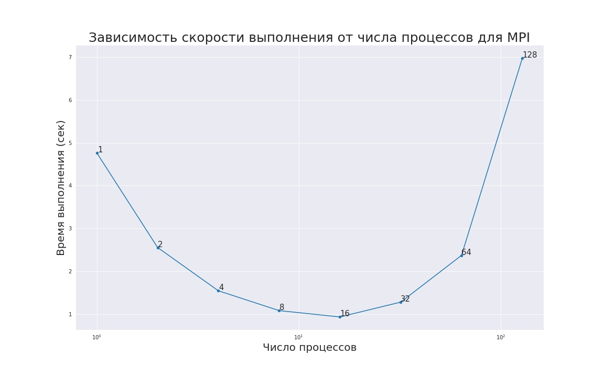

# red-black-3d-parallel
Задание по курсу параллельных вычислений, читаемому на ВМК в 5 семестре

Команды для запуска программ можно найти [здесь](https://github.com/Alexkkir/red-black-3d-parallel/blob/main/how%20to%20run.md)

### Результаты 
Удалось существенно увеличить скорость программы (до 8 раз). Ниже представлены графики, показывающие зависимость времени выполнения от количества потоков

